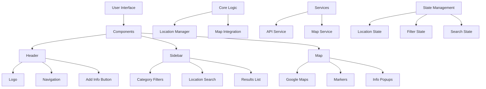

```mermaid
graph TD
    A[User Interface] --> B[Components]
    B --> C[Header]
    B --> D[Sidebar]
    B --> E[Map]
    
    C --> C1[Logo]
    C --> C2[Navigation]
    C --> C3[Add Info Button]
    
    D --> D1[Category Filters]
    D --> D2[Location Search]
    D --> D3[Results List]
    
    E --> E1[Google Maps]
    E --> E2[Markers]
    E --> E3[Info Popups]
    
    F[Core Logic] --> G[Location Manager]
    F --> H[Map Integration]
    
    I[Services] --> J[API Service]
    I --> K[Map Service]
    
    L[State Management] --> M[Location State]
    L --> N[Filter State]
    L --> O[Search State]
```
