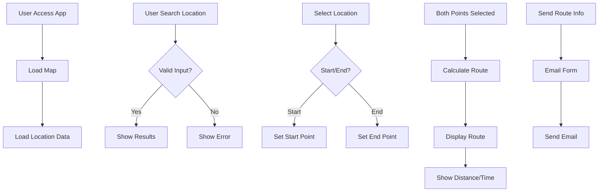

# Quy Trình Chạy Của Dự Án Logistics Manager

## 1. Khởi Động Ứng Dụng

### Frontend (React)
1. Khởi tạo React app
2. Load các components chính:
   - Map Component (Leaflet)
   - Sidebar Component
   - Header Component
3. Khởi tạo các services:
   - Location Service
   - Routing Service
   - API Service

### Backend (API)
1. Khởi động server
2. Kết nối database
3. Khởi tạo các endpoints

## 2. Luồng Xử Lý Chính

## 3. Các Module Chính

### Map Module
- Hiển thị bản đồ
- Quản lý markers
- Hiển thị routes

### Sidebar Module
- Tìm kiếm địa điểm
- Hiển thị kết quả
- Quản lý thông tin route

### Location Service
- Quản lý dữ liệu địa điểm
- Tìm kiếm và lọc
- Lấy vị trí hiện tại

### Routing Service
- Tính toán đường đi
- Hiển thị khoảng cách
- Gửi thông tin route

## 4. Quy Trình Phát Triển

### Setup Môi Trường
1. Clone repository
2. Install dependencies
3. Setup environment variables

### Development
1. Run development server
2. Code changes
3. Testing
4. Code review

### Deployment
1. Build production
2. Test production build
3. Deploy to server

## 5. Testing

### Unit Tests
- Components
- Services
- Utilities

### Integration Tests
- API endpoints
- Service interactions
- Component interactions

### E2E Tests
- User flows
- Performance
- Cross-browser

## 6. Maintenance

### Monitoring
- Error tracking
- Performance metrics
- User analytics

### Updates
- Dependencies
- Security patches
- Feature updates

## 7. Security

### Authentication
- User login
- API authentication
- Token management

### Data Protection
- HTTPS
- Input validation
- XSS prevention

## 8. Performance Optimization

### Frontend
- Code splitting
- Lazy loading
- Caching

### Backend
- Query optimization
- Response caching
- Load balancing
