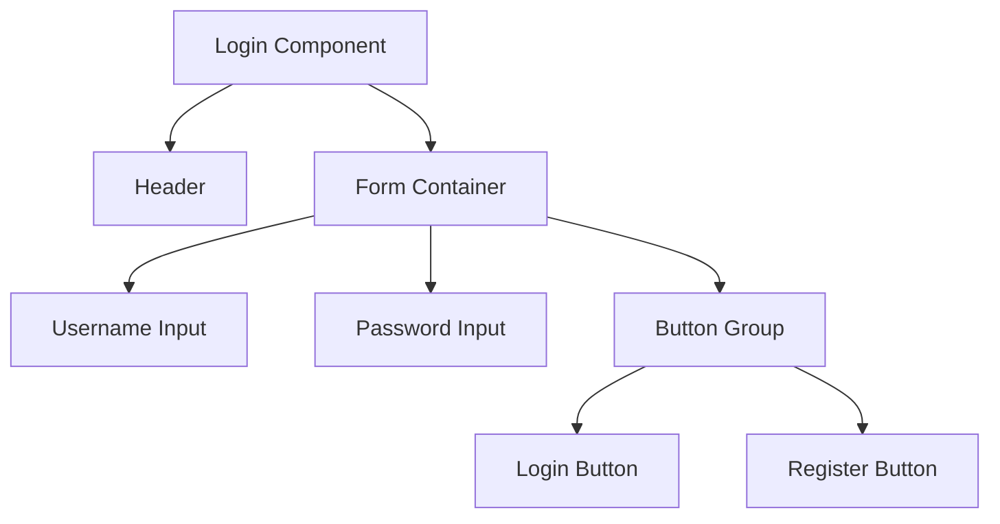
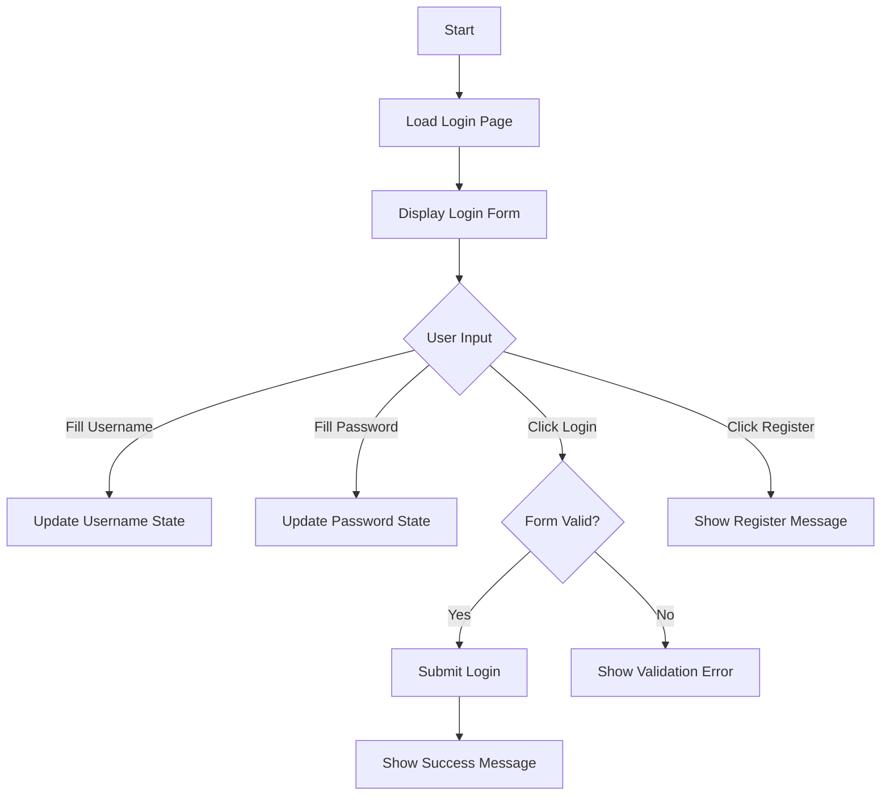
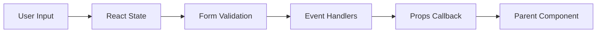

# Login Module Flowchart

## Component Structure

```mermaid
graph TD
    A[Login Component] --> B[Header]
    A --> C[Form Container]
    C --> D[Username Input]
    C --> E[Password Input]
    C --> F[Button Group]
    F --> G[Login Button]
    F --> H[Register Button]
```

## User Flow

```mermaid
graph TD
    A[Start] --> B[Load Login Page]
    B --> C[Display Login Form]
    C --> D{User Input}
    D -->|Fill Username| E[Update Username State]
    D -->|Fill Password| F[Update Password State]
    D -->|Click Login| G{Form Valid?}
    G -->|Yes| H[Submit Login]
    G -->|No| I[Show Validation Error]
    H --> J[Show Success Message]
    D -->|Click Register| K[Show Register Message]
```

## Data Flow

```mermaid
graph LR
    A[User Input] --> B[React State]
    B --> C[Form Validation]
    C --> D[Event Handlers]
    D --> E[Props Callback]
    E --> F[Parent Component]
```
