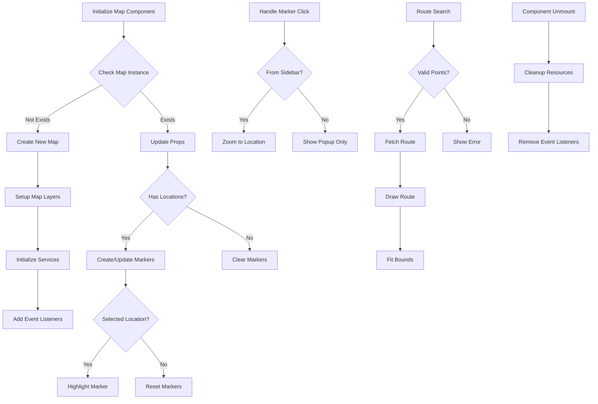

```mermaid
flowchart TD
    A[Initialize Map Component] --> B{Check Map Instance}
    B -->|Exists| C[Update Props]
    B -->|Not Exists| D[Create New Map]
    
    D --> E[Setup Map Layers]
    E --> F[Initialize Services]
    F --> G[Add Event Listeners]
    
    C --> H{Has Locations?}
    H -->|Yes| I[Create/Update Markers]
    H -->|No| J[Clear Markers]
    
    I --> K{Selected Location?}
    K -->|Yes| L[Highlight Marker]
    K -->|No| M[Reset Markers]
    
    N[Handle Marker Click] --> O{From Sidebar?}
    O -->|Yes| P[Zoom to Location]
    O -->|No| Q[Show Popup Only]
    
    R[Route Search] --> S{Valid Points?}
    S -->|Yes| T[Fetch Route]
    S -->|No| U[Show Error]
    
    T --> V[Draw Route]
    V --> W[Fit Bounds]
    
    X[Component Unmount] --> Y[Cleanup Resources]
    Y --> Z[Remove Event Listeners]
```
