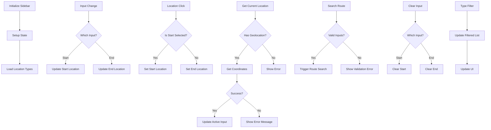

```mermaid
flowchart TD
    A[Initialize Sidebar] --> B[Setup State]
    B --> C[Load Location Types]
    
    D[Input Change] --> E{Which Input?}
    E -->|Start| F[Update Start Location]
    E -->|End| G[Update End Location]
    
    H[Location Click] --> I{Is Start Selected?}
    I -->|Yes| J[Set Start Location]
    I -->|No| K[Set End Location]
    
    L[Get Current Location] --> M{Has Geolocation?}
    M -->|Yes| N[Get Coordinates]
    M -->|No| O[Show Error]
    
    N --> P{Success?}
    P -->|Yes| Q[Update Active Input]
    P -->|No| R[Show Error Message]
    
    S[Search Route] --> T{Valid Inputs?}
    T -->|Yes| U[Trigger Route Search]
    T -->|No| V[Show Validation Error]
    
    W[Clear Input] --> X{Which Input?}
    X -->|Start| Y[Clear Start]
    X -->|End| Z[Clear End]
    
    AA[Type Filter] --> AB[Update Filtered List]
    AB --> AC[Update UI]
```
