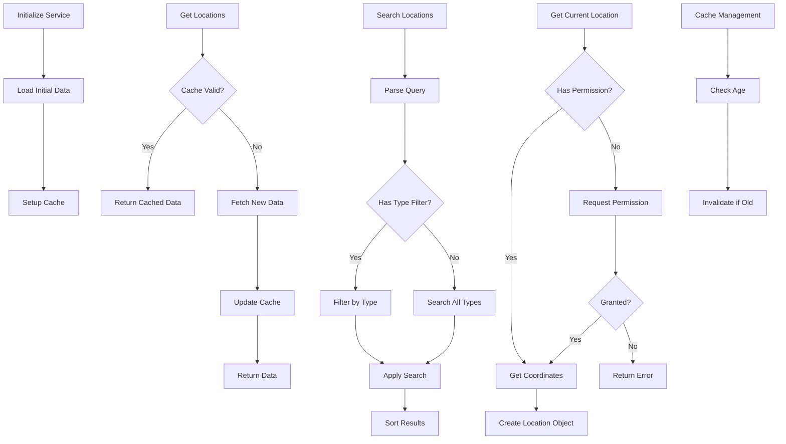

```mermaid
flowchart TD
    A[Initialize Service] --> B[Load Initial Data]
    B --> C[Setup Cache]
    
    D[Get Locations] --> E{Cache Valid?}
    E -->|Yes| F[Return Cached Data]
    E -->|No| G[Fetch New Data]
    
    G --> H[Update Cache]
    H --> I[Return Data]
    
    J[Search Locations] --> K[Parse Query]
    K --> L{Has Type Filter?}
    L -->|Yes| M[Filter by Type]
    L -->|No| N[Search All Types]
    
    M --> O[Apply Search]
    N --> O
    O --> P[Sort Results]
    
    Q[Get Current Location] --> R{Has Permission?}
    R -->|Yes| S[Get Coordinates]
    R -->|No| T[Request Permission]
    
    S --> U[Create Location Object]
    T --> V{Granted?}
    V -->|Yes| S
    V -->|No| W[Return Error]
    
    X[Cache Management] --> Y[Check Age]
    Y --> Z[Invalidate if Old]
```
