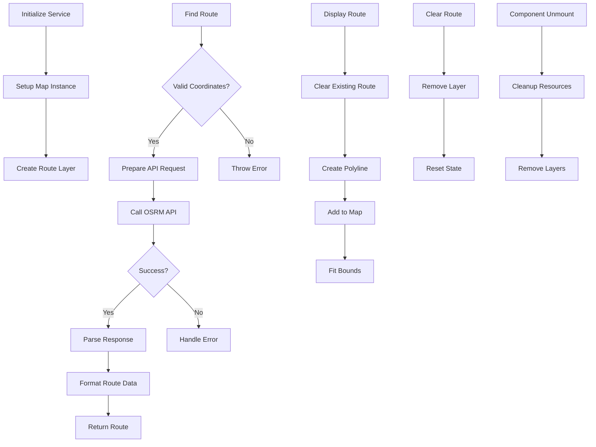

```mermaid
flowchart TD
    A[Initialize Service] --> B[Setup Map Instance]
    B --> C[Create Route Layer]
    
    D[Find Route] --> E{Valid Coordinates?}
    E -->|Yes| F[Prepare API Request]
    E -->|No| G[Throw Error]
    
    F --> H[Call OSRM API]
    H --> I{Success?}
    I -->|Yes| J[Parse Response]
    I -->|No| K[Handle Error]
    
    J --> L[Format Route Data]
    L --> M[Return Route]
    
    N[Display Route] --> O[Clear Existing Route]
    O --> P[Create Polyline]
    P --> Q[Add to Map]
    Q --> R[Fit Bounds]
    
    S[Clear Route] --> T[Remove Layer]
    T --> U[Reset State]
    
    V[Component Unmount] --> W[Cleanup Resources]
    W --> X[Remove Layers]
```
